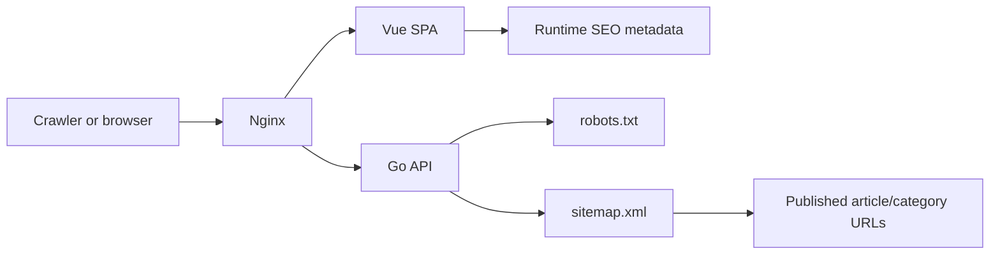

# SEO/GEO Optimization Design

## Goal

Improve discoverability for public articles without changing the current Vue SPA architecture or exposing private backend pages to crawlers.

## Scope

- Add deterministic runtime metadata for public pages: title, description, canonical URL, Open Graph, Twitter card, and robots directives.
- Add Article JSON-LD for published article pages using rendered article fields only.
- Add `robots.txt` and `sitemap.xml` from the Go API so crawlers can discover published articles and avoid `/backend`, setup, login, API, and operational routes.
- Keep private/admin surfaces `noindex,nofollow`.
- Use the existing `DOMAIN` runtime config as the public canonical origin, with local fallbacks for development.

## Non-Goals

- No SSR or SSG migration in this pass.
- No paid SEO tooling integration.
- No invented author profiles, ratings, reviews, or fake organization data.
- No AI-generated SEO keyword stuffing. GEO here means clearer machine-readable context, not search manipulation.

## Frontend Design

Create a small `web/frontend/src/util/seo.ts` utility that owns all metadata updates. It will:

- Normalize public origins and absolute URLs.
- Convert HTML content to safe plain text descriptions.
- Truncate titles/descriptions to stable, readable lengths.
- Upsert managed tags with `data-managed="nostalgia-seo"` to avoid duplicates.
- Emit one managed JSON-LD script for article pages.

The router will set static defaults after navigation:

- Home/category/search/article loading pages are indexable by default.
- Login, register, setup, `/backend`, auth verification, 403, and 404 pages are `noindex,nofollow`.

`ArticleView.vue` will replace the loading metadata after the article API resolves. Canonical article URLs prefer `/article/{slug}` and fall back to `/article/{id}`.

## Backend Design

Add a small SEO handler module under `api/`:

- `GET /robots.txt` returns plain text with disallow rules for private/non-content routes and a sitemap URL.
- `GET /sitemap.xml` returns XML with home, category pages, and published article URLs.

The sitemap uses published articles only. Article loc values prefer slugs and fall back to UUIDs. `lastmod` uses `updated_at` when present and `created_at` otherwise.

## Data Flow

## Validation

- Frontend unit tests cover URL normalization, description cleanup, article metadata payloads, robots defaults, and DOM upsert behavior.
- Backend API tests cover robots output, sitemap XML, published article loc generation, category loc generation, and store errors.
- Deployment tests cover Nginx proxying of `/robots.txt` and `/sitemap.xml`.
- Full verification remains `make test`, `bun test`, `bun run type-check`, `bun run build`, Compose config checks, and `git diff --check`.

## References

- Google Search Central sitemap, robots, title/snippet, JavaScript SEO, and structured data guidance.
- Bing webmaster guidance for crawler discovery via robots and sitemap.
